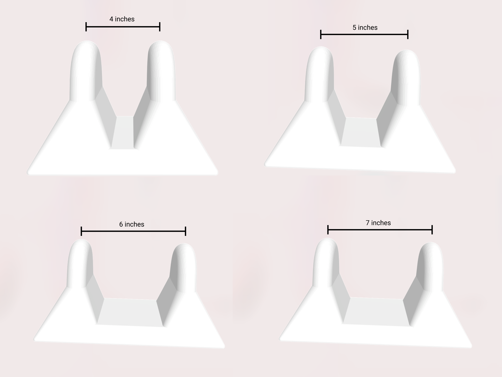

# Myofascial Release Devices

If you sit in a chair for work all day like I do, you may have discovered the amazing [PSO-Rite](https://pso-rite.com/) for loosing up your psoas and piriformis hip muscles.

One thing I've found dissatisfying, however, is that these devices only come in one size! Look no further.

This repository uses OpenSCAD to generate 3D printable models with configurable sizes. Grab one of the [prebuilt STL files](./stl) and print one yourself.



## Developer

```sh
node build.js
```

TODO:
- Spine
- Groin
- Neck